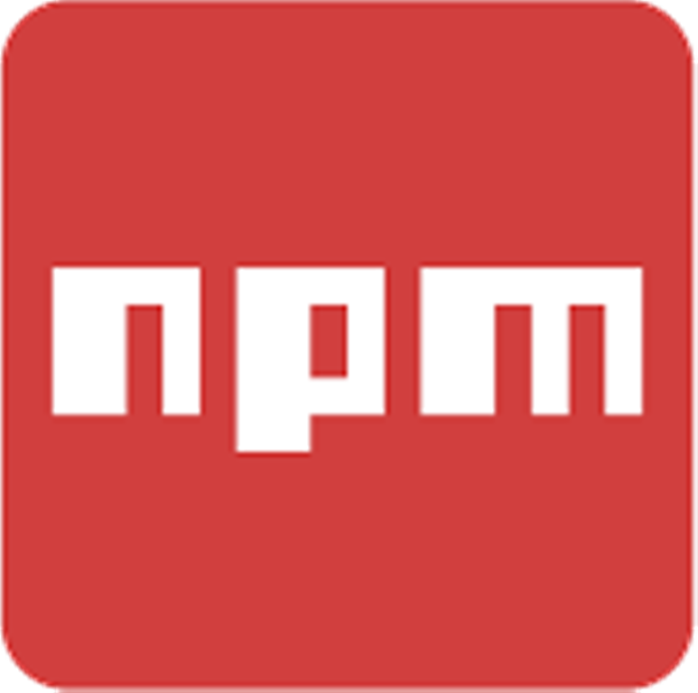

---

#### ***NPM*** is the world’s largest software registry. Open source developers from every continent use ***NPM*** to share and borrow packages, and many organizations use ***NPM*** to manage private development as well.

---

***NPM*** consists of three distinct components:

-   the website
-   the Command Line Interface (CLI)
-   the registry

Use the [*website*](https://npmjs.com/) to discover packages, set up profiles, and manage other aspects of your ***NPM*** experience. For example, you can set up [organizations](https://www.npmjs.com/features) to manage access to public or private packages.

The [*CLI*](https://docs.npmjs.com/cli/npm) runs from a terminal, and is how most developers interact with ***NPM***.

The [*registry*](https://docs.npmjs.com/misc/registry) is a large public database of JavaScript software and the meta-information surrounding it.

---

## Use ***NPM*** to . . .

-   Adapt packages of code for your apps, or incorporate packages as they are.
-   Download standalone tools you can use right away.
-   Run packages without downloading using [npx](https://www.npmjs.com/package/npx).
-   Share code with any npm user, anywhere.
-   Restrict code to specific developers.
-   Create organizations to coordinate package maintenance, coding, and developers.
-   Form virtual teams by using organizations.
-   Manage multiple versions of code and code dependencies.
-   Update applications easily when underlying code is updated.
-   Discover multiple ways to solve the same puzzle.
-   Find other developers who are working on similar problems and projects.
   
---

## Getting started

To get started with ***NPM***, you can [create an account](https://www.npmjs.com/signup), which will be available at <http://www.npmjs.com/~*yourusername>*.

After you set up an ***NPM*** account, the next step is to use the command line interface (CLI) to [install npm](https://docs.npmjs.com/downloading-and-installing-node-js-and-npm). We look forward to seeing what you create!

---

Sharing packages and collaborating with others

If you choose to share your packages publicly, there is no cost. To use and share private packages, you need to upgrade your account. To share with others, create organizations, called **[npm organizations](https://docs.npmjs.com/organizations)**, and invite others to work with you, privately (for a fee) or publicly (for free). Or you can sign up for a private instance of ***NPM*** for your company, called **[npm Enterprise](https://npmjs.com/enterprise)**, so you can develop packages internally that are not shared publicly.

---

## Learn more

To learn more about ***NPM*** as a product, upcoming new features, and interesting uses of ***NPM***, sign up for our newsletter at [npm-weekly](https://www.npmjs.com/npm-weekly), and be sure to follow [@npmjs](https://twitter.com/npmjs) on Twitter.

For mentoring, tutorials, and learning, visit [node school](https://nodeschool.io/). Consider attending or hosting a nodeschool event (usually free!) at a site near you, or use the self-help tools you can find on the site.

---

### CLI reference documentation

While relevant CLI commands are covered throughout this user documentation, the CLI includes command line help, its own [documentation section, and instant help (man pages)](https://docs.npmjs.com/cli-documentation).

---

## Getting started

-   [Setting up your npm user account](https://docs.npmjs.com/getting-started/setting-up-your-npm-user-account)
    -   [Creating a new user account on the public registry](https://docs.npmjs.com/creating-a-new-npm-user-account)
    -   [Creating a strong password](https://docs.npmjs.com/creating-a-strong-password)
    -   [About two-factor authentication](https://docs.npmjs.com/about-two-factor-authentication)
    -   [Configuring two-factor authentication](https://docs.npmjs.com/configuring-two-factor-authentication)
    -   [Recovering your 2FA-enabled account](https://docs.npmjs.com/recovering-your-2fa-enabled-account)
-   [Managing your npm user account](https://docs.npmjs.com/getting-started/managing-your-npm-user-account)
    -   [Managing your profile settings](https://docs.npmjs.com/managing-your-profile-settings)
    -   [Changing your npm username](https://docs.npmjs.com/changing-your-npm-username)
    -   [Deleting your npm user account](https://docs.npmjs.com/deleting-your-npm-user-account)
-   [Paying for your npm user account](https://docs.npmjs.com/getting-started/paying-for-your-npm-user-account)
    -   [Upgrading to a paid user account plan](https://docs.npmjs.com/upgrading-to-a-paid-user-account-plan)
    -   [Viewing, downloading, and emailing receipts for your npm user account](https://docs.npmjs.com/viewing-downloading-and-emailing-receipts-for-your-user-account)
    -   [Updating user account billing settings](https://docs.npmjs.com/updating-user-account-billing-settings)
    -   [Downgrading to a free user account plan](https://docs.npmjs.com/downgrading-to-a-free-user-account-plan)
-   [Configuring your local environment](https://docs.npmjs.com/getting-started/configuring-your-local-environment)
    -   [About npm CLI versions](https://docs.npmjs.com/about-npm-versions)
    -   [Downloading and installing Node.js and npm](https://docs.npmjs.com/downloading-and-installing-node-js-and-npm)
    -   [Configuring your registry settings as an npm Enterprise user](https://docs.npmjs.com/configuring-your-registry-settings-as-an-npm-enterprise-user)
    -   [Logging in to an npm Enterprise registry from the command line](https://docs.npmjs.com/logging-in-to-an-npm-enterprise-registry-from-the-command-line)
-   [Troubleshooting](https://docs.npmjs.com/getting-started/troubleshooting)
    -   [Generating and locating npm-debug.log files](https://docs.npmjs.com/generating-and-locating-npm-debug.log-files)
    -   [Common errors](https://docs.npmjs.com/common-errors)
    -   [Try the latest stable version of node](https://docs.npmjs.com/try-the-latest-stable-version-of-node)
    -   [Try the latest stable version of npm](https://docs.npmjs.com/try-the-latest-stable-version-of-npm)

---

## Packages and modules

-   [Introduction to packages and modules](https://docs.npmjs.com/packages-and-modules/introduction-to-packages-and-modules)
    -   [About the public npm registry](https://docs.npmjs.com/about-the-public-npm-registry)
    -   [About packages and modules](https://docs.npmjs.com/about-packages-and-modules)
    -   [About scopes](https://docs.npmjs.com/about-scopes)
    -   [About public packages](https://docs.npmjs.com/about-public-packages)
    -   [About private packages](https://docs.npmjs.com/about-private-packages)
    -   [npm package scope, access level, and visibility](https://docs.npmjs.com/package-scope-access-level-and-visibility)
-   [Contributing packages to the registry](https://docs.npmjs.com/packages-and-modules/contributing-packages-to-the-registry)
    -   [Creating a package.json file](https://docs.npmjs.com/creating-a-package-json-file)
    -   [Creating Node.js modules](https://docs.npmjs.com/creating-node-js-modules)
    -   [About package README files](https://docs.npmjs.com/about-package-readme-files)
    -   [Creating and publishing unscoped public packages](https://docs.npmjs.com/creating-and-publishing-unscoped-public-packages)
    -   [Creating and publishing scoped public packages](https://docs.npmjs.com/creating-and-publishing-scoped-public-packages)
    -   [Creating and publishing private packages](https://docs.npmjs.com/creating-and-publishing-private-packages)
    -   [Package name guidelines](https://docs.npmjs.com/package-name-guidelines)
    -   [Specifying dependencies and devDependencies in a package.json file](https://docs.npmjs.com/specifying-dependencies-and-devdependencies-in-a-package-json-file)
    -   [About semantic versioning](https://docs.npmjs.com/about-semantic-versioning)
    -   [Adding dist-tags to packages](https://docs.npmjs.com/adding-dist-tags-to-packages)
-   [Updating and managing your published packages](https://docs.npmjs.com/packages-and-modules/updating-and-managing-your-published-packages)
    -   [Changing package visibility](https://docs.npmjs.com/changing-package-visibility)
    -   [Adding collaborators to private packages owned by a user account](https://docs.npmjs.com/adding-collaborators-to-private-packages-owned-by-a-user-account)
    -   [Updating your published package version number](https://docs.npmjs.com/updating-your-published-package-version-number)
    -   [Deprecating and undeprecating packages or package versions](https://docs.npmjs.com/deprecating-and-undeprecating-packages-or-package-versions)
    -   [Transferring a package from a user account to another user account](https://docs.npmjs.com/transferring-a-package-from-a-user-account-to-another-user-account)
    -   [Unpublishing packages from the registry](https://docs.npmjs.com/unpublishing-packages-from-the-registry)
-   [Getting packages from the registry](https://docs.npmjs.com/packages-and-modules/getting-packages-from-the-registry)
    -   [Searching for and choosing packages to download](https://docs.npmjs.com/searching-for-and-choosing-packages-to-download)
    -   [Downloading and installing packages locally](https://docs.npmjs.com/downloading-and-installing-packages-locally)
    -   [Downloading and installing packages globally](https://docs.npmjs.com/downloading-and-installing-packages-globally)
    -   [Resolving EACCES permissions errors when installing packages globally](https://docs.npmjs.com/resolving-eacces-permissions-errors-when-installing-packages-globally)
    -   [Updating packages downloaded from the registry](https://docs.npmjs.com/updating-packages-downloaded-from-the-registry)
    -   [Using npm packages in your projects](https://docs.npmjs.com/using-npm-packages-in-your-projects)
    -   [Using deprecated packages](https://docs.npmjs.com/using-deprecated-packages)
    -   [Uninstalling packages and dependencies](https://docs.npmjs.com/uninstalling-packages-and-dependencies)
-   [Securing your code](https://docs.npmjs.com/packages-and-modules/securing-your-code)
    -   [About audit reports](https://docs.npmjs.com/about-audit-reports)
    -   [Auditing package dependencies for security vulnerabilities](https://docs.npmjs.com/auditing-package-dependencies-for-security-vulnerabilities)
    -   [About package PGP signatures](https://docs.npmjs.com/about-pgp-signatures-for-packages-in-the-public-registry)
    -   [Verifying the PGP signature of a package from the npm public registry](https://docs.npmjs.com/verifying-the-pgp-signature-for-a-package-from-the-npm-public-registry)
    -   [Requiring 2FA for package publishing and settings modification](https://docs.npmjs.com/requiring-2fa-for-package-publishing-and-settings-modification)
    -   [Reporting malware in an npm package](https://docs.npmjs.com/reporting-malware-in-an-npm-package)

---

## Integrations

-   [Integrating npm with external services](https://docs.npmjs.com/integrations/integrating-npm-with-external-services)
    -   [About access tokens](https://docs.npmjs.com/about-access-tokens)
    -   [Creating and viewing access tokens](https://docs.npmjs.com/creating-and-viewing-access-tokens)
    -   [Revoking access tokens](https://docs.npmjs.com/revoking-access-tokens)
    -   [Using private packages in a CI/CD workflow](https://docs.npmjs.com/using-private-packages-in-a-ci-cd-workflow)
    -   [Docker and private modules](https://docs.npmjs.com/docker-and-private-modules)

---

## Organizations

Organizations allow teams of contributors to read, write, and public and private packages. Organizations are free when they publish public packages. When organizations publish private packages, an npm Teams subscription is required. For more information on ***NPM*** Teams pricing, see our [products page](https://www.npmjs.com/pricing).

-   [Creating and managing organizations](https://docs.npmjs.com/organizations/creating-and-managing-organizations)
    -   [Creating an organization](https://docs.npmjs.com/creating-an-organization)
    -   [Converting your user account to an organization](https://docs.npmjs.com/converting-your-user-account-to-an-organization)
    -   [Renaming an organization](https://docs.npmjs.com/renaming-an-organization)
    -   [Deleting an organization](https://docs.npmjs.com/deleting-an-organization)
-   [Paying for your organization](https://docs.npmjs.com/organizations/paying-for-your-organization)
    -   [Upgrading to a paid organization plan](https://docs.npmjs.com/upgrading-to-a-paid-organization-plan)
    -   [Viewing, downloading, and emailing receipts for your organization](https://docs.npmjs.com/viewing-downloading-and-emailing-receipts-for-your-organization)
    -   [Updating organization billing settings](https://docs.npmjs.com/updating-organization-billing-settings)
    -   [Downgrading to a free organization plan](https://docs.npmjs.com/downgrading-to-a-free-organization-plan)
-   [Managing organization members](https://docs.npmjs.com/organizations/managing-organization-members)
    -   [Adding members to your organization](https://docs.npmjs.com/adding-members-to-your-organization)
    -   [Accepting or rejecting an organization invitation](https://docs.npmjs.com/accepting-or-rejecting-an-organization-invitation)
    -   [Organization roles and permissions](https://docs.npmjs.com/organization-roles-and-permissions)
    -   [Managing organization permissions](https://docs.npmjs.com/managing-organization-permissions)
    -   [Removing members from your organization](https://docs.npmjs.com/removing-members-from-your-organization)
-   [Managing teams](https://docs.npmjs.com/organizations/managing-teams)
    -   [About the Developers team](https://docs.npmjs.com/about-developers-team)
    -   [Creating teams](https://docs.npmjs.com/creating-teams)
    -   [Adding organization members to teams](https://docs.npmjs.com/adding-organization-members-to-teams)
    -   [Removing organization members from teams](https://docs.npmjs.com/removing-organization-members-from-teams)
    -   [Managing team access to organization packages](https://docs.npmjs.com/managing-team-access-to-organization-packages)
    -   [Removing teams](https://docs.npmjs.com/removing-teams)
-   [Managing organization packages](https://docs.npmjs.com/organizations/managing-organization-packages)
    -   [About organization scopes and packages](https://docs.npmjs.com/about-organization-scopes-and-packages)
    -   [Configuring your npm client with your organization settings](https://docs.npmjs.com/configuring-your-npm-client-with-your-organization-settings)
    -   [Creating and publishing an organization scoped package](https://docs.npmjs.com/creating-and-publishing-an-organization-scoped-package)

---

## npm Enterprise

**Note:** ***NPM*** Enterprise will be retired on June 30, 2021. For more information, please visit our [FAQ about npm Enterprise plans](https://docs.npmjs.com/sunsetting-npm-enterprise).

-   [Setup and configuration](https://docs.npmjs.com/enterprise/setup-and-configuration)
    -   [Getting started with npm Enterprise](https://docs.npmjs.com/getting-started-with-npm-enterprise)
    -   [Configuring an authentication provider](https://docs.npmjs.com/configuring-an-authentication-provider)
    -   [Defining a security policy](https://docs.npmjs.com/defining-security-policy)
-   [Billing and seat management](https://docs.npmjs.com/enterprise/billing-and-seat-management)
    -   [Purchasing or removing seats](https://docs.npmjs.com/purchasing-or-removing-seats)
    -   [Updating billing information](https://docs.npmjs.com/updating-billing-information)
-   [User management](https://docs.npmjs.com/enterprise/user-management)
    -   [About the Enterprise admin user](https://docs.npmjs.com/about-the-enterprise-admin-user)
    -   [Promoting a non-admin user to admin](https://docs.npmjs.com/promoting-a-non-admin-user-to-admin)
    -   [Demoting an admin to a non-admin user](https://docs.npmjs.com/demoting-an-admin-to-a-non-admin-user)
    -   [Managing user security](https://docs.npmjs.com/managing-user-security)
    -   [Viewing, deactivating, and reactivating users](https://docs.npmjs.com/viewing-deactivating-and-reactivating-users)
    -   [Creating and managing organization and teams](https://docs.npmjs.com/creating-and-managing-organizations-and-teams)
    -   [Permanently deleting a user](https://docs.npmjs.com/permanently-deleting-a-user)
    -   [npm Enterprise roles and permissions](https://docs.npmjs.com/npm-enterprise-roles-and-permissions)
-   [Migration](https://docs.npmjs.com/enterprise/migration)
    -   [Migrating from an existing npm Enterprise instance](https://docs.npmjs.com/migrating-from-an-existing-enterprise-instance)
    -   [Migrating from an organization on the public registry](https://docs.npmjs.com/migrating-from-an-organization-on-the-public-registry)
-   [Sunset](https://docs.npmjs.com/enterprise/sunset)
    -   [Sunsetting npm Enterprise](https://docs.npmjs.com/sunsetting-npm-enterprise)

---

## CLI documentation

Version 6.x (LTS release)

-   [CLI Commands](https://docs.npmjs.com/cli/v6/commands)
-   [Configuring npm](https://docs.npmjs.com/cli/v6/configuring-npm)
-   [Using npm](https://docs.npmjs.com/cli/v6/using-npm)

---
